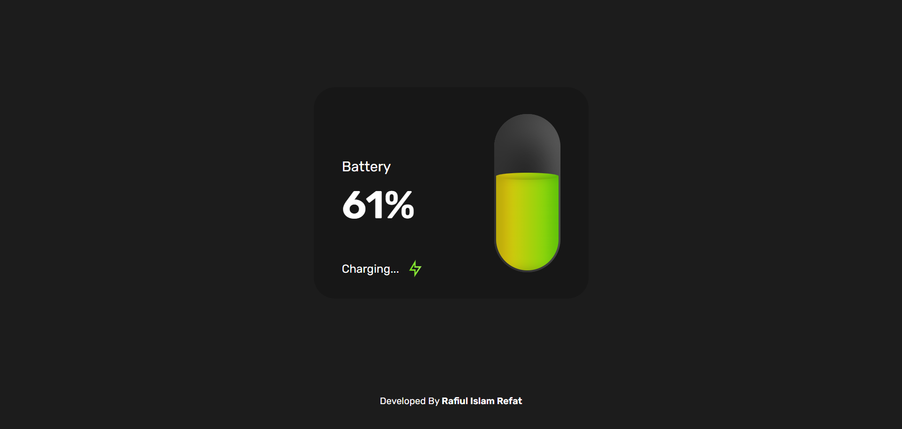

# Battery Level Indicator
This is a simple UI Design of Battery Level Indicator.    
Live Preview: [https://rirefat.github.io/3D-Login-Page/](https://rirefat.github.io/3D-Login-Page/) 

## Get in touch:
- Fiverr: [https://www.fiverr.com/rafiul_refat](https://www.fiverr.com/rafiul_refat) 
- Upwork: [https://www.upwork.com/freelancers/~0142a4c4d9d621a489](https://www.upwork.com/freelancers/~0142a4c4d9d621a489) 
- Portfolio: [https://rirefat.netlify.app/](https://rirefat.netlify.app/) 
- Email: <a href="mailto:rirefat.official@gmail.com">rirefat.official@gmail.com</a>